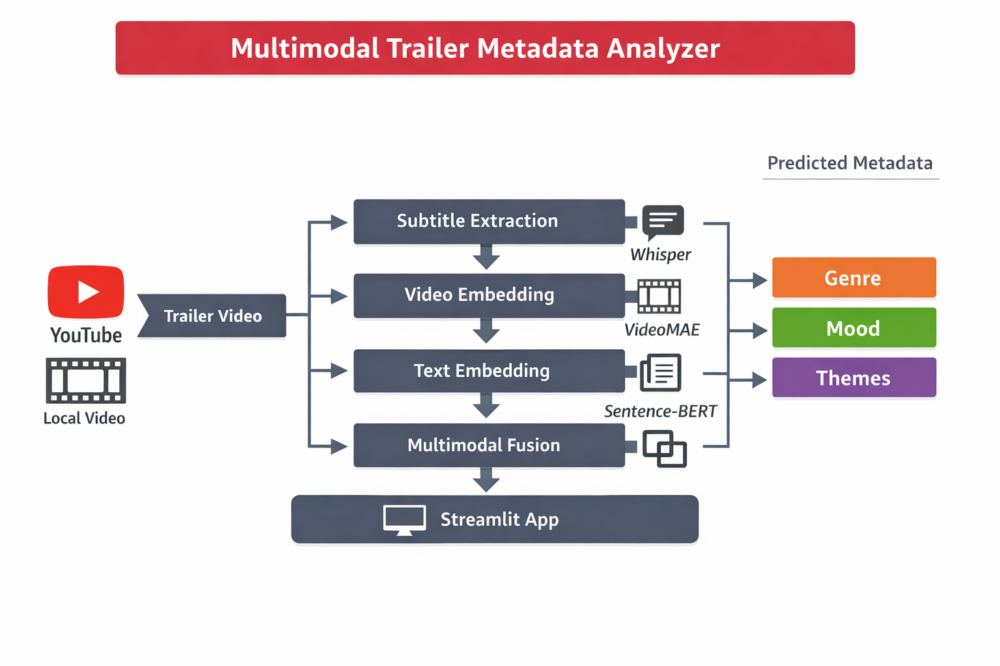

#  Multimodal Trailer Metadata Analyzer

**Netflix-style multimodal ML system** that ingests movie trailers (YouTube or local),
extracts video and subtitle signals, and predicts **genre, mood, and themes**
to support **content discovery, metadata enrichment, and cold-start ranking**.

## Problem
Streaming platforms face weak or incomplete metadata for new content, which negatively impacts search relevance, discovery, and cold-start ranking.

## Solution
Built a Netflix-style multimodal machine learning system that ingests movie trailers (local files or YouTube URLs) and automatically generates genre, mood, and theme metadata using video and subtitle signals.

## System Overview

- Subtitle extraction using Whisper  
- Video embeddings using VideoMAE  
- Text embeddings using Sentence-BERT  
- Multimodal fusion via concatenation  
- Multi-label classifier with sigmoid outputs  
- Deployed via Streamlit demo

## Evaluation
Multi-label classification evaluated using Micro and Macro F1 scores (~0.95 on a curated dataset).  
Emphasis was placed on system robustness rather than raw accuracy due to limited dataset size.

## Core Skills Demonstrated
- Multimodal ML (video + text)
- Metadata enrichment & weak labels
- PyTorch training pipelines
- Multi-label evaluation metrics
- Robust inference and deployment

## Engineering Strengths
- Production-minded ingestion (YouTube, ffmpeg)
- Modular codebase and clean structure
- Model trade-off reasoning (compute vs accuracy)
- Failure analysis and scalability planning
## Where This Would Be Used in Production
- Content discovery & search relevance
- Cold-start ranking for new titles
- Merchandising rows (mood/theme-based collections)
- Editorial decision support

## Interview Positioning Statement
“I build production-oriented ML systems that transform raw media into structured, trustworthy signals for discovery, ranking, and personalization.”

## Failure Cases & Limitations

- **Noisy or missing subtitles**  
  Whisper transcription errors can reduce text embedding quality, which impacts downstream predictions.

- **Music-heavy or dialogue-light trailers**  
  When subtitles contain little semantic content, the model relies more heavily on video embeddings.

- **Small dataset size**  
  With a limited number of labeled trailers, there is a risk of overfitting and optimistic evaluation scores.

- **Threshold sensitivity in multi-label prediction**  
  Fixed probability thresholds may not generalize well across different genres or moods.

---

## Key Trade-Offs & Design Decisions

- **Pre-trained embeddings vs end-to-end training**  
  Used VideoMAE and Sentence-BERT to enable faster iteration and stable performance on small datasets, at the cost of task-specific fine-tuning.

- **Concatenation-based fusion vs attention-based fusion**  
  Simple concatenation was chosen as a strong, interpretable baseline with fewer failure modes before exploring more complex fusion strategies.

- **Resolution normalization (360p)**  
  Normalizing video resolution improves inference stability and compute efficiency, but may discard fine-grained visual details.

- **Model simplicity vs expressiveness**  
  A lightweight classifier improves interpretability and debuggability, while leaving room for future architectural upgrades.

